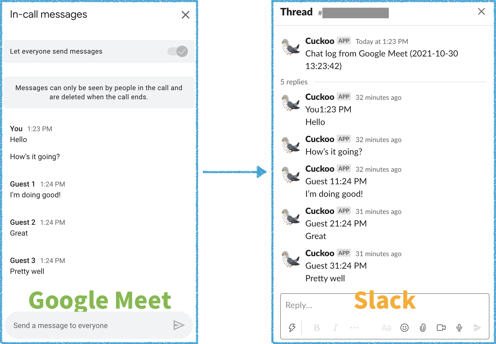

# Cuckoo

Cuckoo is a browser extension that allows you to post chat messages on Google Meet to a Slack channel.

This is the best way to log conversations because chat messages on Google Meet are deleted when its call ends.

## Installation (TBD)
* Cuckoo - Chrome Web Store
* Cuckoo - Firefox Add-ons

I am now preparing to release it. Stay tuned!

## Setup
1. Head over to the options page of this extension
2. Fill in the information that it needs to work
3. Change other preferences if you need to

That is done!

## How it works
Heading over to Google Meet, this extension starts to work automatically. All you have to do is open a chat box on Google Meet, send a message or wait someone sending it, and see if it is posted to Slack.

## Change log
See [CHANGELOG.md](CHANGELOG.md).
